# C4 Components Diagram — function-factory

> Phase 4 · Architect · Generated 2026-06-08 · Updated 2026-06-10
> Focus: ff-pipeline Worker (the most complex container)

```mermaid
C4Component
    title ff-pipeline Worker — Component View

    Container_Boundary(ffPipeline, "ff-pipeline Worker") {

        Component(pipelineWorkflow, "FactoryPipeline Workflow", "WorkflowEntrypoint", "Durable step executor. Runs 27+ named steps. Entry: pipeline.ts:run()")

        Component(ingestSignal, "ingestSignal", "Stage function", "Validates, deduplicates (idempotency hash against D1), and persists Signal. Uses @factory/db-client.")

        Component(synthesizePressure, "synthesizePressure", "Stage function (LLM)", "Interprets Signal as a named force (Pressure). Uses 'planning' task kind.")

        Component(mapCapability, "mapCapability", "Stage function (LLM)", "Identifies the system Capability needed to address a Pressure.")

        Component(proposeFunction, "proposeFunction", "Stage function (LLM)", "Proposes a Function with IntentSpecification. Enforces birth gate (score >= 0.5). Two prompts: generative vs spec-grounded.")

        Component(semanticReview, "semanticReview", "Stage function (LLM)", "Pre-compile Critic-at-authoring. Checks IntentSpecification alignment. Advisory in current mode.")

        Component(crystallizeIntent, "crystallizeIntent", "Stage function (LLM)", "Generates 3-6 IntentAnchor binary checkpoints from signal intent. Persists to intent_anchors collection.")

        Component(compileIntentSpec, "compileIntentSpecification", "Stage function (LLM x8)", "8-pass compiler: decompose→dependency→invariant→interface→binding→validation→assembly→verification. Assembly and verification are deterministic. Assembly saves ES to D1 via db-client.")

        Component(probeAnchors, "probeAnchors", "Stage function (LLM, isolated)", "Isolated probe LLM call. Checks compiled pass delta against IntentAnchors. Binary yes/no only.")

        Component(reconcileGate, "reconcile", "Pure function", "Deterministic gate: no violations→PASS, log-only→PASS, warn-only→WARN, block<max→REMEDIATE, block>=max→ESCALATE.")

        Component(coherenceVerification, "evaluateCoherenceVerification", "Service Binding call", "Calls ff-gates GatesService via CF Service Binding. 5 deterministic checks.")

        Component(formulaCompilerAdapter, "formulaCompilerAdapter", "Dispatch adapter", "buildFormulaCompilerDeps() wires db-client (@factory/db-client) operations as injected deps for Formula compiler. compileAndDispatchFormula() drives Gas City dispatch.")

        Component(keepaliveWiring, "keepalive lifecycle", "HTTP client (GAS_CITY service binding)", "POST /v0/keepalive/start on formula dispatch. POST /v0/keepalive/stop on RELEASE or amendment_halted. 5s timeout, best-effort (fail-open). Driven by dispatch-formula and webhook-receiver steps.")

        Component(webhookReceiver, "webhookReceiver", "HTTP handler", "HMAC-verified Gas City completion + operational events. Uses @factory/db-client for D1 reads/writes (dispatch_log, completion_events, fidelity_verdicts, specs_functions). Best-effort keepalive stop after each callback.")

        Component(autonomyMonitor, "GasCityAutonomyMonitor", "Cron + HTTP handler", "15-min cron. Full sweep: accepted→monitored transitions, stale dispatch detection, recurring incident escalation. Uses @factory/db-client for all D1 queries.")

        Component(modelBridge, "callModel", "Routing layer", "Routes task kinds (planning/structured/synthesis/probe/etc.) to provider via @factory/task-routing.")

        Component(generateFeedback, "generateFeedbackSignals", "Stage function", "Converts synthesis results into feedback Signals. Enforces depth cap (3) and cooldown (30 min).")

        Component(captureLearning, "captureLearningTranscript", "Utility", "Persists run transcripts and derives learning observations. Fail-open with configurable timeout.")

        Component(driftLedger, "appendDriftEntry", "Utility", "Persists probe results to D1 drift_ledger via db-client for post-analysis. Best-effort, never blocks.")

        Component(synthesisCoordinatorDO, "SynthesisCoordinator DO", "DurableObject binding", "Receives synthesis dispatch via SYNTHESIS_QUEUE. Validates TrellisExecutionPacket. Runs synthesis fiber.")

        Component(loopClosureService, "LoopClosureService", "@factory/loop-closure service", "Bridges ArtifactGraphDO and BeadGraphDO. Five bridge point methods: openSession, recordExecution, recordOutcome, proposeAmendment, adoptAmendment. Writes ElucidationArtifact unconditionally on adoption.")

        Component(coordinatorDOHooks, "CoordinatorDO hooks", "@factory/gears DurableObject", "Per-run execution trace hooks: claimHook (claim ExecutionBead before dispatch), releaseBead (success path), failBead (failure path), writeAudit (INSERT to D1 factory-bead-audit).")

        Component(factoryDivergenceDetector, "factoryDivergenceDetector", "Domain function — @factory/factory-graph", "Maps tool-call logs vs WorkGraph invariant specs to Divergence candidates. Called by LoopClosureService.recordOutcome() on outcome mismatch. Returns DivergenceCandidate[].")

        Component(factoryHypothesisBuilder, "factoryHypothesisBuilder", "Domain function — @factory/factory-graph", "Constructs Hypothesis from Divergence candidates. Uses Claude Opus for natural-language hypothesis generation. Returns HypothesisContent.")

        Component(factoryAmendmentVerifier, "factoryAmendmentVerifier", "Domain function — @factory/factory-graph", "Runs VerificationProcess before Amendment adoption. Executes Coverage Gates 1/2/3 (unit/integration/invariant coverage checks). Returns VerificationResult with passed boolean.")
    }

    Rel(pipelineWorkflow, ingestSignal, "step.do('ingest-signal')")
    Rel(pipelineWorkflow, synthesizePressure, "step.do('synthesize-pressure')")
    Rel(pipelineWorkflow, mapCapability, "step.do('map-capability')")
    Rel(pipelineWorkflow, proposeFunction, "step.do('propose-function')")
    Rel(pipelineWorkflow, semanticReview, "step.do('semantic-review')")
    Rel(pipelineWorkflow, crystallizeIntent, "step.do('crystallize-intent')")
    Rel(pipelineWorkflow, compileIntentSpec, "step.do('compile-verify-{pass}-r{n}')")
    Rel(compileIntentSpec, probeAnchors, "probe delta output")
    Rel(probeAnchors, reconcileGate, "probe results + anchors")
    Rel(pipelineWorkflow, coherenceVerification, "step.do('coherence-verification')")
    Rel(pipelineWorkflow, formulaCompilerAdapter, "step.do('dispatch-formula')")
    Rel(formulaCompilerAdapter, keepaliveWiring, "keepalive/start before dispatch")
    Rel(webhookReceiver, keepaliveWiring, "keepalive/stop on completion callback")
    Rel(pipelineWorkflow, synthesisCoordinatorDO, "SYNTHESIS_QUEUE → /synthesize")
    Rel(synthesizePressure, modelBridge, "callModel('planning', ...)")
    Rel(mapCapability, modelBridge, "callModel('planning', ...)")
    Rel(proposeFunction, modelBridge, "callModel('planning', ...)")
    Rel(compileIntentSpec, modelBridge, "callModel(taskKind, ...)")
    Rel(probeAnchors, modelBridge, "callModel('probe', ...)")
    Rel(pipelineWorkflow, generateFeedback, "feedback queue consumer")
    Rel(pipelineWorkflow, captureLearning, "captureTerminal() on all exit paths")
    Rel(compileIntentSpec, driftLedger, "appendDriftEntry (best-effort)")

    Rel(pipelineWorkflow, loopClosureService, "openSession() before dispatch-formula step")
    Rel(formulaCompilerAdapter, loopClosureService, "recordExecution() after Gas City dispatch")
    Rel(webhookReceiver, loopClosureService, "recordOutcome() on completion callback (approved/revise)")
    Rel(loopClosureService, factoryDivergenceDetector, "detectDivergences(trace) on outcome mismatch")
    Rel(loopClosureService, factoryHypothesisBuilder, "buildHypothesis(divergences) for amendment loop")
    Rel(loopClosureService, factoryAmendmentVerifier, "verifyAmendment(amendment) before adoption")
    Rel(formulaCompilerAdapter, coordinatorDOHooks, "claimHook() before Gas City dispatch")
    Rel(webhookReceiver, coordinatorDOHooks, "releaseBead() on approved; failBead() on revise/timeout")
```

---

## KSP Component Wiring — Session Lifecycle

The LoopClosureService coordinates the five bridge points across the session lifecycle:

| Bridge Point | Method | Source Component | Target Storage |
|-------------|--------|-----------------|---------------|
| Session open | `openSession(config)` | `pipelineWorkflow` (dispatch-formula step) | BeadGraphDO (PolicyBead retrieval) + KV hot cache |
| Execution | `recordExecution(sessionId, trace)` | `formulaCompilerAdapter` | ArtifactGraphDO (Execution node) + BeadGraphDO (ExecutionBead) |
| Outcome | `recordOutcome(sessionId, outcome)` | `webhookReceiver` | ArtifactGraphDO (ExecutionTrace ± Divergence nodes); invokes `factoryDivergenceDetector` if divergent |
| Amendment | `proposeAmendment(divergenceId, hypothesis)` | automatic after outcome | ArtifactGraphDO (Hypothesis + Amendment nodes); invokes `factoryHypothesisBuilder` |
| Adoption | `adoptAmendment(amendmentId)` | after `factoryAmendmentVerifier` passes | ArtifactGraphDO (new Specification + ElucidationArtifact nodes); KV invalidation |

CoordinatorDO hooks fire at the same dispatch/callback points as the pipeline formula dispatch step:

| Hook | When | D1 Write |
|------|------|---------|
| `claimHook` | Before Gas City dispatch | bead_audit INSERT (verdict: 'claimed') |
| `releaseBead` | On `approved` webhook | bead_audit INSERT (verdict: 'released') |
| `failBead` | On `revise` webhook or timeout | bead_audit INSERT (verdict: 'failed') |
| `writeAudit` | Any step — explicit call | bead_audit INSERT (verdict: caller-supplied) |

---

## db-client Usage by Component

| Component | db-client operations |
|-----------|---------------------|
| `ingestSignal` | D1 SELECT (idempotency key lookup), INSERT (signal doc) |
| `compileIntentSpec` (assembly pass) | D1 INSERT (executable_specifications doc) |
| `formulaCompilerAdapter` | D1 INSERT (dispatch_log, formulas) via `buildFormulaCompilerDeps` |
| `webhookReceiver` | D1 SELECT (dispatch_log, completion_events), INSERT/UPDATE (completion_events, fidelity_verdicts, specs_functions) |
| `autonomyMonitor` | D1 SELECT (specs_functions, dispatch_log, fidelity_verdicts, completion_events), INSERT (persistence_verdicts, specs_incidents) |
| `driftLedger` | D1 INSERT (compilation_drift_ledger) |
| `HotConfigLoader` | D1 SELECT (config_aliases, config_routing, config_model_capabilities, hot_config) |
