# C4 Containers Diagram — function-factory

> Phase 4 · Architect · Generated 2026-06-08 · Updated 2026-06-10

```mermaid
C4Container
    title Function Factory — Container View

    Person(architect, "Architect (Human)")

    System_Boundary(factory, "Function Factory") {

        Container(ffGateway, "ff-gateway", "CF Worker", "Public HTTP gateway and routing layer")

        Container(ffPipelineWorker, "ff-pipeline Worker", "CF Worker (WorkflowEntrypoint)", "Hosts FactoryPipeline workflow. Handles queue consumers for SYNTHESIS_RESULTS, ATOM_RESULTS, FEEDBACK_QUEUE. Routes /synthesis-callback.")

        Container(factoryPipeline, "FactoryPipeline", "CF Workflow", "Durable orchestration of all 24+ pipeline steps: Signal ingest → Pressure → Capability → Proposal → Approve → SemanticReview → Crystallize → Compile (8 passes) → CoherenceCheck → Formula dispatch → Keepalive lifecycle")

        Container(synthesisCoordinator, "SynthesisCoordinator", "CF DurableObject (Agent)", "Agent host. Validates TrellisExecutionPacket, runs synthesis fiber, publishes result to SYNTHESIS_RESULTS queue. Graph path deprecated (interrupt verdict).")

        Container(atomExecutor, "AtomExecutor", "CF DurableObject", "Per-atom execution DO. One DO instance per atom. Independent lifetime and crash recovery.")

        Container(ffGates, "ff-gates", "CF WorkerEntrypoint", "Coherence Verification. Deterministic 5-check gate. No LLM. Target <10ms. Accessed via Service Binding only.")

        Container(gasCitySupervisor, "GasCitySupervisor", "CF Container (DurableObject)", "Wraps Gas City daemon on port 9443. Keepalive refcount (POST /v0/keepalive/start|stop lifecycle). Proxies all routes with X-GC-Request header.")

        Container(factoryStore, "FactoryStore", "CF DurableObject (SQLite)", "SQLite-backed bead/spec store. Tables: beads, deps, specifications, verification_processes. 1MB max payload.")

        Container(ffArango, "ff-arango", "CF Container Worker", "ArangoDB proxy. Routes artifact-graph DB calls without exposing ArangoDB publicly.")

        Container(packages, "@factory/packages", "pnpm library packages", "Domain logic: schemas, compiler, verification, signal-hygiene, db-client (replaces arango-client), task-routing, file-context, etc.")

        Container(artifactGraphDO, "ArtifactGraphDO", "CF DurableObject (SQLite) — @factory/artifact-graph", "Lineage-authoritative record of spec-execution cycle. nodes + edges tables. One DO per namespace (domain:org:scope). Append-only.")

        Container(beadGraphDO, "BeadGraphDO", "CF DurableObject (SQLite + KV) — @factory/bead-graph", "Knowing-state content: PolicyBead, TrustBead, ExecutionBead, OutcomeBead, AmendmentBead, ConsentBead, EscalationBead, AuditBead. Content-addressed append-only DAG. One DO per org.")

        Container(coordinatorDO, "CoordinatorDO", "CF DurableObject — @factory/gears", "Per-run execution trace. Manages claimHook, releaseBead, failBead, writeAudit lifecycle. Routes to D1 factory-bead-audit for cross-run audit log.")

        Container(loopClosureService, "LoopClosureService", "CF Worker service — @factory/loop-closure", "Bridges ArtifactGraphDO and BeadGraphDO across five bridge points: session open, execution, outcome, amendment, adoption. Writes ElucidationArtifact on every adoption (INV-KSP-004).")

        Container(kspSdk, "KnowingStateSDK", "pnpm library — @factory/ksp-sdk", "Re-exports KnowingStateSDK interface and Session types from bead-graph. Zero factory-specific imports. Consumed by harness-bridge and Gas City session layer.")

        Container(factoryGraph, "FactoryGraphDO", "CF DurableObject — @factory/factory-graph", "Domain instantiation: extends ArtifactGraphDOBase + BeadGraphDOBase. Adds Factory-specific query methods (factoryDivergenceDetector, factoryHypothesisBuilder, factoryAmendmentVerifier).")

    }

    SystemDb(d1Factory, "D1 (ff-factory)", "Cloudflare D1 SQLite", "Operational state store. Two-table model: documents + edges. Holds idempotency keys, config, assembly results, drift ledger entries, dispatch logs.")
    SystemDb(d1Audit, "D1 (factory-bead-audit)", "Cloudflare D1 SQLite", "Cross-run KSP audit log only. Table: bead_audit(run_id, bead_id, gear_id, agent_id, verdict, attempt, ts). Written by CoordinatorDO.")
    SystemDb(cfKV, "CF KV (knowing-state cache)", "Cloudflare KV", "Hot cache for knowing-state. Key patterns: ks:{orgId}:{roleId}:{category} TTL 300s, head:{orgId}:{bead_type} TTL 300s, maintenance:{orgId} TTL 60s, session:{sessionId} TTL 3600s. Invalidated on amendment adoption.")
    SystemDb(arango, "ArangoDB", "Graph DB", "Artifact graph: signals, pressures, capabilities, ES, lineage, ORL telemetry, memory collections.")
    System_Ext(gasCityPlatform, "Gas City Platform")
    System_Ext(github, "GitHub")
    System_Ext(workersAI, "Workers AI")
    SystemDb(cfQueues, "CF Queues")

    Rel(architect, ffGateway, "HTTP requests")
    Rel(ffGateway, ffPipelineWorker, "Routes inbound signals")
    Rel(ffPipelineWorker, factoryPipeline, "Creates and manages workflow instances")
    Rel(factoryPipeline, ffGates, "evaluateCoherenceVerification()", "CF Service Binding")
    Rel(factoryPipeline, cfQueues, "Enqueue synthesis, feedback, atoms")
    Rel(ffPipelineWorker, synthesisCoordinator, "POST /synthesize (via queue consumer)")
    Rel(synthesisCoordinator, atomExecutor, "Dispatches atoms (vertical slicing)")
    Rel(atomExecutor, synthesisCoordinator, "Reports atom results via callback")
    Rel(synthesisCoordinator, cfQueues, "Publishes synthesis results to SYNTHESIS_RESULTS")
    Rel(ffPipelineWorker, cfQueues, "Consumes SYNTHESIS_RESULTS, sends workflow event")
    Rel(factoryPipeline, workersAI, "LLM calls (all AI passes)")
    Rel(factoryPipeline, d1Factory, "Operational state R/W via @factory/db-client (ingest-signal, compile:assembly, config, keepalive dispatch)")
    Rel(ffGates, d1Factory, "Lineage completeness check via @factory/db-client")
    Rel(ffGateway, d1Factory, "Config + routing queries via @factory/db-client")
    Rel(factoryPipeline, arango, "Artifact graph CRUD + lineage edges via ff-arango proxy")
    Rel(ffArango, arango, "Proxy HTTP to ArangoDB")
    Rel(gasCitySupervisor, gasCityPlatform, "Molecule dispatch + execution")
    Rel(gasCityPlatform, ffPipelineWorker, "Webhook callbacks (completion + operational events)")
    Rel(factoryPipeline, gasCitySupervisor, "POST /v0/keepalive/start|stop (CF Service Binding: GAS_CITY)")
    Rel(gasCitySupervisor, factoryStore, "Bead CRUD operations")
    Rel(factoryPipeline, github, "File context fetch, PR creation")
    Rel(ffPipelineWorker, packages, "Imports @factory/db-client, schemas, compiler, verification, task-routing, etc.")

    Rel(loopClosureService, artifactGraphDO, "Writes Specification, Execution, Divergence, Hypothesis, Amendment, ElucidationArtifact nodes")
    Rel(loopClosureService, beadGraphDO, "Reads/writes PolicyBead, TrustBead, ExecutionBead, OutcomeBead, AmendmentBead")
    Rel(loopClosureService, cfKV, "Reads knowing-state hot cache; invalidates on amendment adoption")
    Rel(factoryGraph, artifactGraphDO, "Extends ArtifactGraphDOBase — Factory domain node/edge types")
    Rel(factoryGraph, beadGraphDO, "Extends BeadGraphDOBase — Factory Bead types")
    Rel(factoryGraph, loopClosureService, "Provides factoryDivergenceDetector, factoryHypothesisBuilder, factoryAmendmentVerifier")
    Rel(coordinatorDO, d1Audit, "writeAudit — bead_audit INSERT per run step")
    Rel(coordinatorDO, beadGraphDO, "claimHook, releaseBead, failBead via BeadGraphDO")
    Rel(ffPipelineWorker, loopClosureService, "Session open/close; delegates execution trace writes")
    Rel(kspSdk, beadGraphDO, "Re-exports KnowingStateSDK interface; no direct storage calls")
```

---

## Binding Summary: D1 vs ArangoDB by Worker

| Worker | D1 (ff-factory) | ArangoDB (via ff-arango) |
|--------|----------------|--------------------------|
| `ff-pipeline` | signal dedup, config, hot-config, drift ledger, assembly output, dispatch logs, completion events, keepalive dispatch | artifact graph (signals, pressures, capabilities, ES, execution artifacts, lineage, ORL, memory) |
| `ff-gates` | lineage completeness check (SQL) | — (migrated from AQL in PR #80) |
| `ff-gateway` | config + routing queries | — |
| `SynthesisCoordinator DO` | config (via DB binding) | completion_ledgers, file_context_cache, execution_artifacts, memory_episodic |
| `AtomExecutor DO` | — | file_context_cache (GitHub content cache) |
| `gascity-supervisor` | — (uses FactoryStore SQLite DO instead) | — |

## KSP Layer — Storage Binding Summary

| Container | DO SQLite | CF KV | D1 (factory-bead-audit) |
|-----------|-----------|-------|------------------------|
| `ArtifactGraphDO` | nodes + edges tables (per namespace) | — | — |
| `BeadGraphDO` | beads + bead_parents + bead_edges tables (per org) | ks:, head:, maintenance: key patterns | — |
| `CoordinatorDO` | — | session:{sessionId} TTL 3600s | bead_audit INSERT per step |
| `LoopClosureService` | — (delegates to both DOs) | Invalidates ks: + head: on adoption | — |
| `FactoryGraphDO` | inherits from ArtifactGraphDO + BeadGraphDO | — | — |
