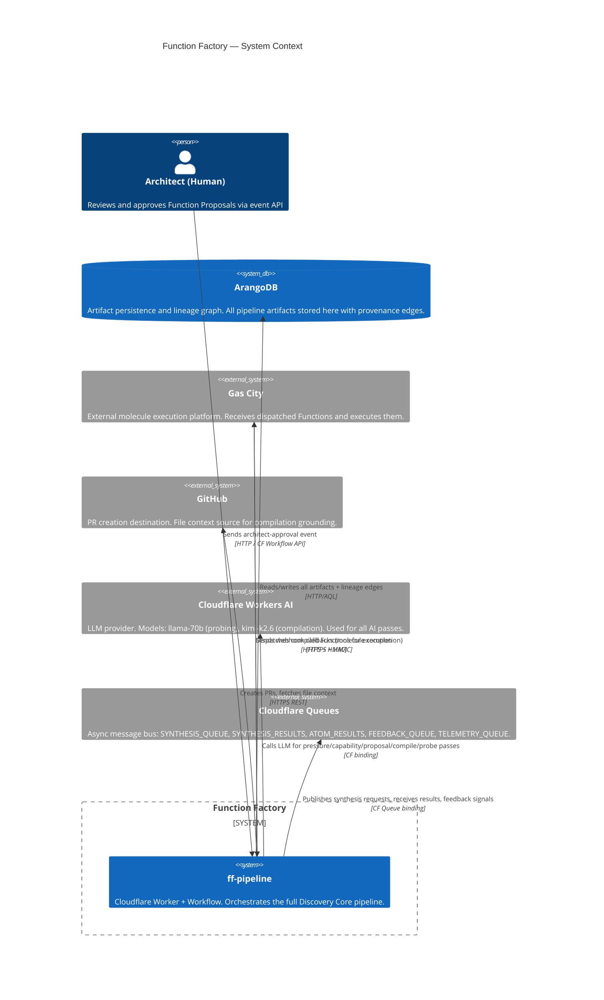

# C4 Context Diagram — function-factory

> Phase 4 · Architect · Generated 2026-06-08

```mermaid
C4Context
    title Function Factory — System Context

    Person(architect, "Architect (Human)", "Reviews and approves Function Proposals via event API")

    System_Boundary(factory, "Function Factory") {
        System(ffPipeline, "ff-pipeline", "Cloudflare Worker + Workflow. Orchestrates the full Discovery Core pipeline.")
    }

    SystemDb(arango, "ArangoDB", "Artifact persistence and lineage graph. All pipeline artifacts stored here with provenance edges.")

    System_Ext(gasCityPlatform, "Gas City", "External molecule execution platform. Receives dispatched Functions and executes them.")

    System_Ext(github, "GitHub", "PR creation destination. File context source for compilation grounding.")

    System_Ext(workersAI, "Cloudflare Workers AI", "LLM provider. Models: llama-70b (probing), kimi-k2.6 (compilation). Used for all AI passes.")

    System_Ext(cfQueues, "Cloudflare Queues", "Async message bus: SYNTHESIS_QUEUE, SYNTHESIS_RESULTS, ATOM_RESULTS, FEEDBACK_QUEUE, TELEMETRY_QUEUE.")

    Rel(architect, ffPipeline, "Sends architect-approval event", "HTTP / CF Workflow API")
    Rel(ffPipeline, arango, "Reads/writes all artifacts + lineage edges", "HTTP/AQL")
    Rel(ffPipeline, gasCityPlatform, "Dispatches compiled Functions for execution", "HTTPS + HMAC")
    Rel(ffPipeline, github, "Creates PRs, fetches file context", "HTTPS REST")
    Rel(ffPipeline, workersAI, "Calls LLM for pressure/capability/proposal/compile/probe passes", "CF binding")
    Rel(ffPipeline, cfQueues, "Publishes synthesis requests, receives results, feedback signals", "CF Queue binding")
    Rel(gasCityPlatform, ffPipeline, "Sends webhook callbacks (molecule completion)", "HTTPS + HMAC")
```
