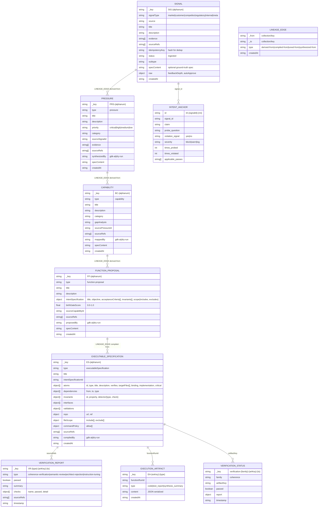
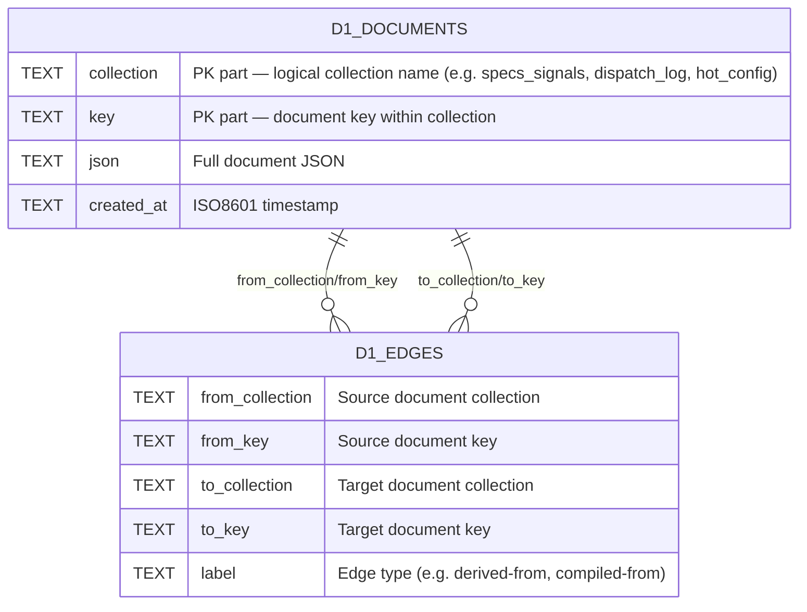

# ERD — function-factory

> Phase 4 · Architect · Generated 2026-06-08 · Updated 2026-06-10
> ArangoDB Collections (Document + Edge) + D1 Operational State



---

## D1 (ff-factory) — Operational State Store

> Introduced in PR #79–#80 (AD-08). Two-table general-purpose model replacing the 48-ArangoDB-collection model for operational/high-frequency paths.
> Workers that bind D1: ff-pipeline, ff-gates, ff-gateway.
> ArangoDB continues to hold all artifact graph entities above.



**D1 logical collections (written via `@factory/db-client`):**

| Logical collection | Written by | Purpose |
|--------------------|-----------|---------|
| `specs_signals` | ingest-signal | Signal deduplication (idempotency key check) |
| `executable_specifications` | compile:assembly pass | Compiled ES persistence |
| `dispatch_log` | formula-compiler | Formula dispatch audit records |
| `formulas` | formula-compiler | Formula artifacts |
| `completion_events` | webhook-receiver | Gas City completion callbacks (idempotency guard) |
| `fidelity_verdicts` | webhook-receiver | Gas City fidelity verdicts |
| `specs_functions` | markFunctionDispatched, autonomy-monitor, webhook-receiver | Function lifecycle state machine |
| `dispatch_log` | autonomy-monitor | Stale dispatch detection |
| `persistence_verdicts` | autonomy-monitor | Persistence VRs |
| `specs_incidents` | autonomy-monitor, webhook-receiver | Operational incidents |
| `compilation_drift_ledger` | drift-ledger | Per-pass probe results |
| `hot_config` | seedHotConfig | Runtime pipeline flags |
| `config_aliases` | seedHotConfig | ORL schema field alias overrides |
| `config_routing` | seedHotConfig | Model routing overrides |
| `config_model_capabilities` | seedHotConfig | Per-model capability profiles |

**Architectural note (AD-08):** D1 is intentionally limited to _operational state_ — records with a single-worker lifecycle (idempotency keys, config, dispatch logs, keepalive state). ArangoDB holds _artifact graph_ state that spans the full pipeline (signals → pressures → capabilities → ES → execution artifacts → lineage). This split avoids ArangoDB connections in high-frequency operational paths and reduces cross-process coupling.

---

## KSP DO SQLite Schemas

The KSP layer uses three independent storage substrates. None of these tables are co-located with the existing D1 (ff-factory) operational store.

### ArtifactGraphDO (per-namespace Durable Object — `@factory/artifact-graph`)

One DO instance per namespace string (`domain:org:scope`). Append-only by convention — no DELETE or UPDATE operations.

```
nodes (
  id          TEXT  PRIMARY KEY,
  type        TEXT  NOT NULL,    -- Specification|Execution|ExecutionTrace|Divergence|Hypothesis|Amendment|ElucidationArtifact|VerificationProcess|Verdict
  data        JSON  NOT NULL,    -- full node payload
  created_at  INTEGER NOT NULL   -- Unix ms
)

edges (
  id          TEXT  PRIMARY KEY,
  from_id     TEXT  NOT NULL REFERENCES nodes(id),
  to_id       TEXT  NOT NULL REFERENCES nodes(id),
  rel         TEXT  NOT NULL,    -- governs|compiled_to|version_of|diverged_from|proposes|if_adopted_produces|forecloses|verifies|source_ref
  data        JSON,              -- optional edge metadata
  created_at  INTEGER NOT NULL
)

INDEX: idx_nodes_type ON nodes(type)
INDEX: idx_edges_from ON edges(from_id)
INDEX: idx_edges_to   ON edges(to_id)
INDEX: idx_edges_rel  ON edges(rel)
```

### BeadGraphDO (per-org Durable Object — `@factory/bead-graph`)

One DO instance per org. Content-addressed: `bead_id = SHA-256(type + canonical_json(content) + sorted(parent_ids))`. All writes in `BEGIN/COMMIT` block including `AuditBead`.

```
beads (
  bead_id     TEXT  PRIMARY KEY,   -- SHA-256 content hash
  type        TEXT  NOT NULL,      -- PolicyBead|TrustBead|ExecutionBead|OutcomeBead|AmendmentBead|ConsentBead|EscalationBead|AuditBead
  content     JSON  NOT NULL,      -- typed Bead content (Zod-validated)
  created_at  INTEGER NOT NULL     -- Unix ms
)

bead_parents (
  bead_id     TEXT  NOT NULL REFERENCES beads(bead_id),
  parent_id   TEXT  NOT NULL REFERENCES beads(bead_id),
  PRIMARY KEY (bead_id, parent_id)
)

bead_edges (
  child_id    TEXT  NOT NULL REFERENCES beads(bead_id),
  parent_id   TEXT  NOT NULL REFERENCES beads(bead_id),
  rel         TEXT  NOT NULL,      -- supersedes|corrects|depends_on|produces|consents_to|escalates
  PRIMARY KEY (child_id, parent_id, rel)
)

INDEX: idx_beads_type ON beads(type)
INDEX: idx_beads_created ON beads(created_at)
```

### D1 factory-bead-audit (cross-run audit log — `@factory/gears` CoordinatorDO)

Separate D1 database from `ff-factory`. Written by `CoordinatorDO.writeAudit()` only. Cross-run, cross-namespace audit log for governance and compliance.

```
bead_audit (
  run_id      TEXT    NOT NULL,   -- pipeline run / workflow ID
  bead_id     TEXT    NOT NULL,   -- BeadGraphDO bead_id reference
  gear_id     TEXT    NOT NULL,   -- CoordinatorDO instance identifier
  agent_id    TEXT    NOT NULL,   -- executing agent identifier
  verdict     TEXT    NOT NULL,   -- claimed|released|failed|audited
  attempt     INTEGER NOT NULL,   -- factory_attempt number (>= 1)
  ts          INTEGER NOT NULL    -- Unix ms

  PRIMARY KEY (run_id, bead_id, attempt)
)

INDEX: idx_bead_audit_run    ON bead_audit(run_id)
INDEX: idx_bead_audit_bead   ON bead_audit(bead_id)
INDEX: idx_bead_audit_ts     ON bead_audit(ts)
```

### KV Key Patterns (CF KV — knowing-state hot cache)

| Key Pattern | TTL | Purpose |
|-------------|-----|---------|
| `ks:{orgId}:{roleId}:{category}` | 300 s | Knowing-state content for a specific role and category. Primary hot-cache key. Invalidated on amendment adoption. |
| `head:{orgId}:{bead_type}` | 300 s | Pointer to the current head bead for a given type within an org. Updated on every new bead write. |
| `maintenance:{orgId}` | 60 s | Maintenance health score freshness. Staleness triggers DEGRADED autonomy floor (I3 enforcement). |
| `session:{sessionId}` | 3600 s | Active session context. Written by `LoopClosureService.openSession()`. Deleted on `adoptAmendment()` completion. |

**Invalidation rule (INV-KSP-006):** `LoopClosureService.adoptAmendment()` deletes `ks:{orgId}:*` and `head:{orgId}:*` keys before returning. New sessions opened after adoption retrieve fresh state from BeadGraphDO.

---

## FactoryStore (SQLite — in GasCitySupervisor DO)

```
beads
  id PK, title, status, issue_type, priority, created_at,
  assignee, from_, parent_id, ref, needs, description, labels, metadata, ephemeral

deps
  issue_id FK→beads.id, depends_on_id FK→beads.id, dep_type
  PK: (issue_id, depends_on_id)

specifications
  id PK, kind, status, payload, agent_id, emission_bead_id FK→beads.id,
  created_at, updated_at

verification_processes
  id PK, spec_id FK→specifications.id, kind, status, agent_id,
  emission_bead_id FK→beads.id, started_at, completed_at, payload
```
