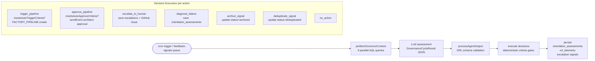
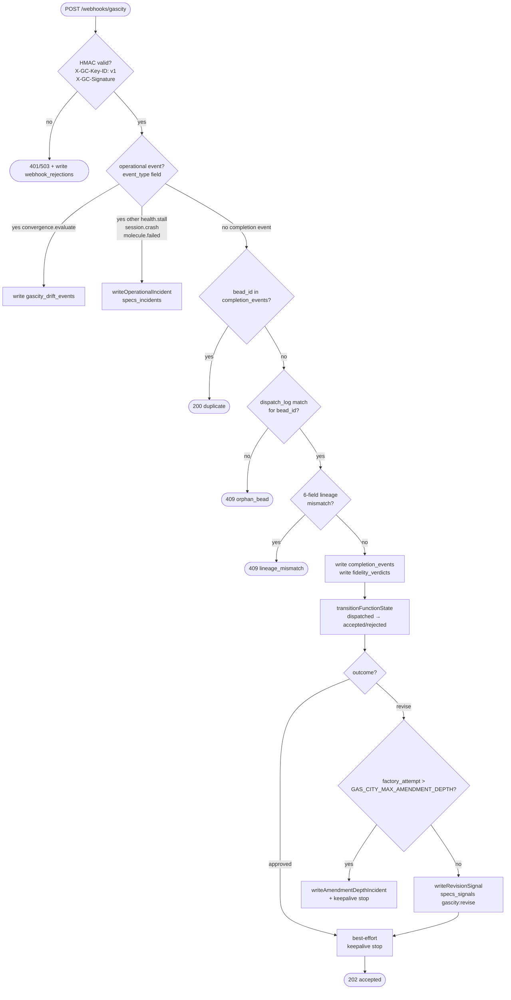
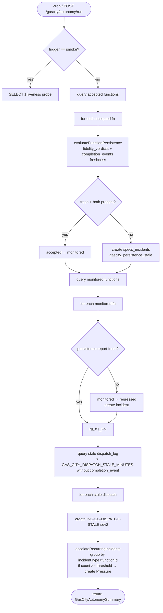

# Flowchart — ff-pipeline (Gas City Era)

> Generated by Reversa Archaeologist · 2026-06-09
> Source: `workers/ff-pipeline/src/pipeline.ts`, `index.ts`, and supporting modules

---

## Main Pipeline Execution Flow

```mermaid
flowchart TD
    START([FactoryPipeline.run\nWorkflowEvent<PipelineParams>]) --> HARNESS_CHECK{job.harnessKey?}
    HARNESS_CHECK -->|yes| HARNESS_REMOVED([status: harness-removed])
    HARNESS_CHECK -->|no| SIGNAL_CHECK{params.signal?}
    SIGNAL_CHECK -->|no| THROW([throw: synthesis path requires signal])
    SIGNAL_CHECK -->|yes| INGEST[1. ingest-signal\nDB_STEP\nDedup via FNV hash]

    INGEST --> PRESSURE[2. synthesize-pressure\nAI_STEP]
    PRESSURE --> EDGE_PS[3. edge-pressure-signal\nDB_STEP]
    EDGE_PS --> CAPABILITY[4. map-capability\nAI_STEP]
    CAPABILITY --> EDGE_CP[5. edge-capability-pressure\nDB_STEP]
    EDGE_CP --> PROPOSAL[6. propose-function\nAI_STEP\nbirthGateScore check < 0.5 = throw]
    PROPOSAL --> EDGE_PC[7. edge-proposal-capability\nDB_STEP]
    EDGE_PC --> AUTO_APPROVE{signal.raw.autoApprove?}

    AUTO_APPROVE -->|true| SKIP_GATE[auto-approve\nfactory:feedback-loop]
    AUTO_APPROVE -->|false| WAIT_GATE[waitForEvent\narchitect-approval\n7-day timeout]
    SKIP_GATE --> GATE_CHECK{decision == approved?}
    WAIT_GATE --> GATE_CHECK
    GATE_CHECK -->|no| PERSIST_REJECT[persist-rejection\nDB_STEP]
    PERSIST_REJECT --> REJECTED([status: rejected → captureTerminal])

    GATE_CHECK -->|yes| SEMANTIC[9. semantic-review\nAI_STEP advisory]
    SEMANTIC --> CRP_CHECK{confidence < 0.7?}
    CRP_CHECK -->|yes| CRP[crp-semantic-review\nDB_STEP\nConsultationRequestPack]
    CRP --> CRYST_LOAD
    CRP_CHECK -->|no| CRYST_LOAD[11. load-crystallizer-config\nDB_STEP]
    CRYST_LOAD --> CRYSTALLIZE[12. crystallize-intent\nAI_STEP\n0 anchors if disabled]
    CRYSTALLIZE --> ANCHOR_CHECK{intentAnchors.length > 0?}
    ANCHOR_CHECK -->|yes| PERSIST_ANCHORS[13. persist-intent-anchors\nDB_STEP]
    ANCHOR_CHECK -->|no| FILE_CTX
    PERSIST_ANCHORS --> FILE_CTX[14. fetch-compile-context\nDB_STEP\nGitHub Contents API]
    FILE_CTX --> COMPILE_LOOP

    subgraph COMPILE_LOOP[Compilation Loop — 8 passes]
        direction TB
        FOR_PASS([for passName in PASS_NAMES]) --> PROBED_CHECK{passName in PROBED_PASSES\nAND passAnchors > 0?}
        PROBED_CHECK -->|yes PROBED path| REMEDIATION_LOOP
        subgraph REMEDIATION_LOOP[Remediation Loop r=0..2]
            COMPILE_VERIFY[compile-verify-{pass}-r{r}\nAI_STEP\ncompile → delta → probe → gate]
            COMPILE_VERIFY --> GATE_VERDICT{gate verdict?}
            GATE_VERDICT -->|pass/warn| BREAK_R([break r-loop])
            GATE_VERDICT -->|remediate| INJECT_FEEDBACK[inject _violationFeedback\nnext r iteration]
            INJECT_FEEDBACK --> COMPILE_VERIFY
            GATE_VERDICT -->|escalate r≥2| ESCALATE_FLAG([intentViolation=true])
        end
        ESCALATE_FLAG --> BREAK_PASS([break pass loop])
        PROBED_CHECK -->|no NON-PROBED path| SIMPLE_COMPILE[compile-{pass}\nAI_STEP]
        SIMPLE_COMPILE --> NEXT_PASS([next pass])
        BREAK_R --> NEXT_PASS
    end

    COMPILE_LOOP --> VIOLATION_CHECK{intentViolation?}
    VIOLATION_CHECK -->|yes| INTENT_VIOLATION([status: synthesis:intent-violation → captureTerminal])
    VIOLATION_CHECK -->|no| EDGE_ES_PROP[17. edge-executableSpecification-proposal\nDB_STEP]
    EDGE_ES_PROP --> COHERENCE[18. coherence-verification\nDB_STEP\nGATES service binding]
    COHERENCE --> COHERENCE_PASS{passed?}
    COHERENCE_PASS -->|no| PERSIST_COH_FAIL[19. persist-coherence-verification-failure\n+ enqueue-feedback-coherence-verification\nDB_STEP]
    PERSIST_COH_FAIL --> COH_FAIL([status: coherence-verification-failed → captureTerminal])
    COHERENCE_PASS -->|yes| PERSIST_COH_PASS[20. persist-coherence-verification-pass\nDB_STEP]
    PERSIST_COH_PASS --> ES_CHECK{executableSpecification?}
    ES_CHECK -->|no| COMPILE_INCOMPLETE([status: compile-incomplete → captureTerminal])
    ES_CHECK -->|yes| SKELETON[22. build-skeleton\nDB_STEP\nGitHub tarball → R2 → signed URL]
    SKELETON --> BUILD_EP[23. build-execution-packet\nDB_STEP\nEP artifact with skeleton vars]
    BUILD_EP --> DISPATCH[24. dispatch-formula\nDB_STEP\ncompileAndDispatchFormula → Gas City]
    DISPATCH --> DISPATCH_CHECK{outcome == dispatched?}
    DISPATCH_CHECK -->|no| DISPATCH_FAIL([status: dispatch-failed → captureTerminal])
    DISPATCH_CHECK -->|yes| MARK_DISPATCHED[26. mark-function-dispatched\nDB_STEP\nlifecycle state machine]
    MARK_DISPATCHED --> DISPATCHED([status: dispatched → captureTerminal])
```

---

## GovernorAgent Cycle



---

## Gas City Webhook Flow



---

## Gas City Autonomy Monitor


