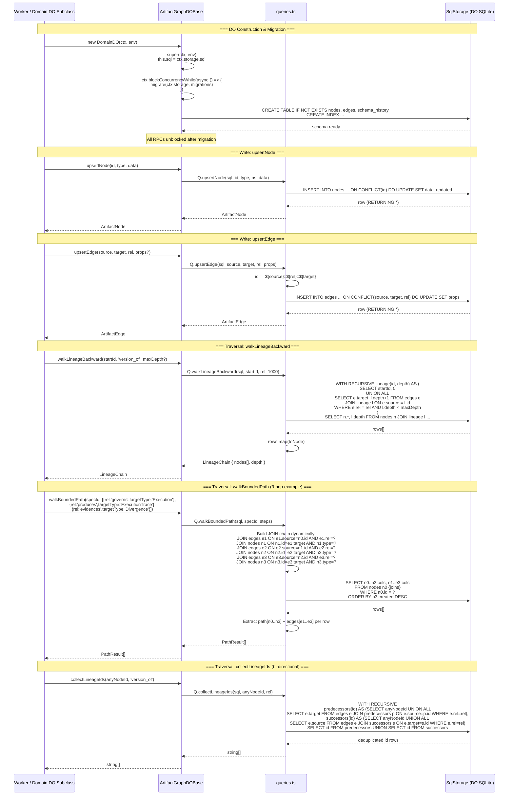
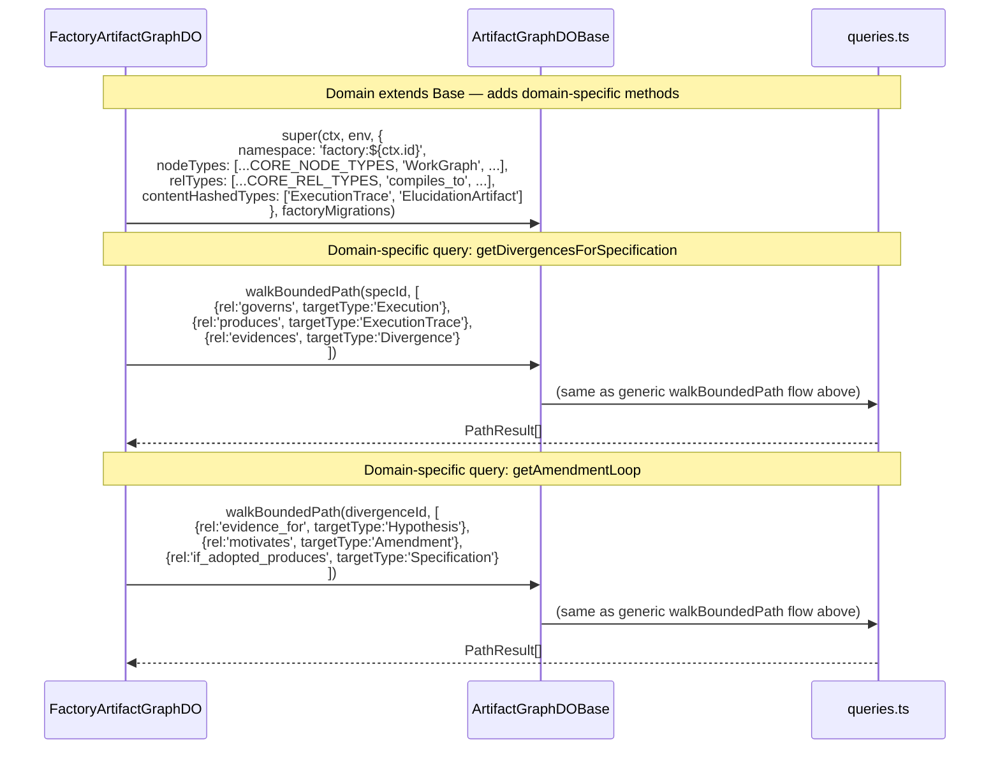
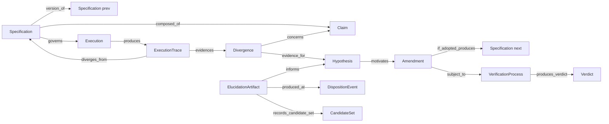

# Flowchart: ksp-artifact-graph (@factory/artifact-graph)
> Source: SPEC-KSP-ARTIFACT-GRAPH-001.md

---

## Main Call Flow: DO Initialization + Node/Edge Write + Traversal

---

## Domain Instantiation Pattern

---

## Spec-Execution Cycle Node Relationships

