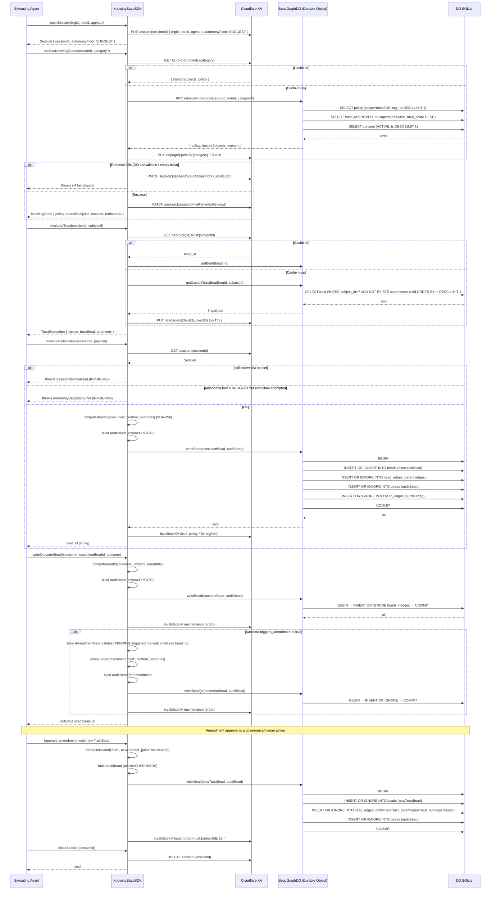
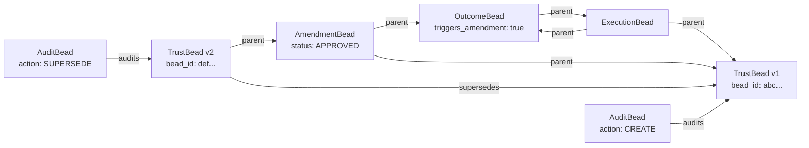
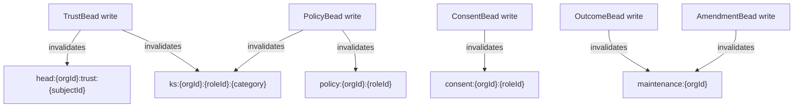

# Flowchart: ksp-bead-graph (@factory/bead-graph)
> Source: SPEC-KSP-BEAD-GRAPH-001.md

---

## Main Call Flow — Session Lifecycle and Execution Write

---

## Bead Supersession Chain (Trust Amendment)

---

## KV Cache Invalidation Map

