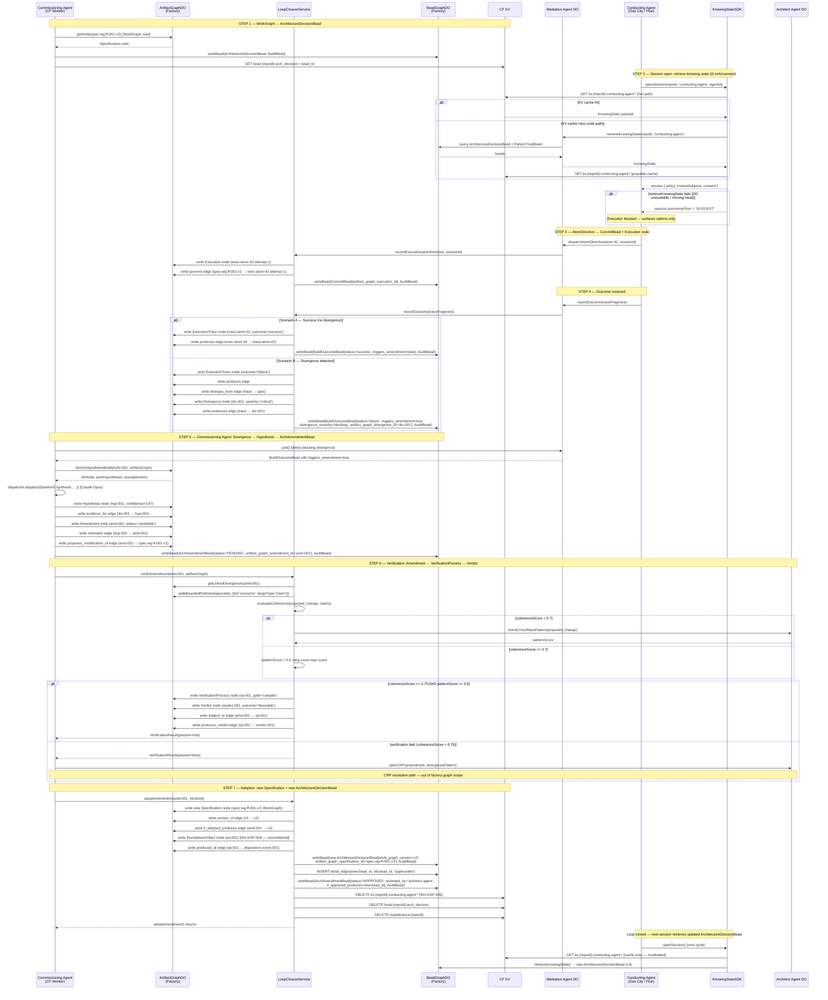
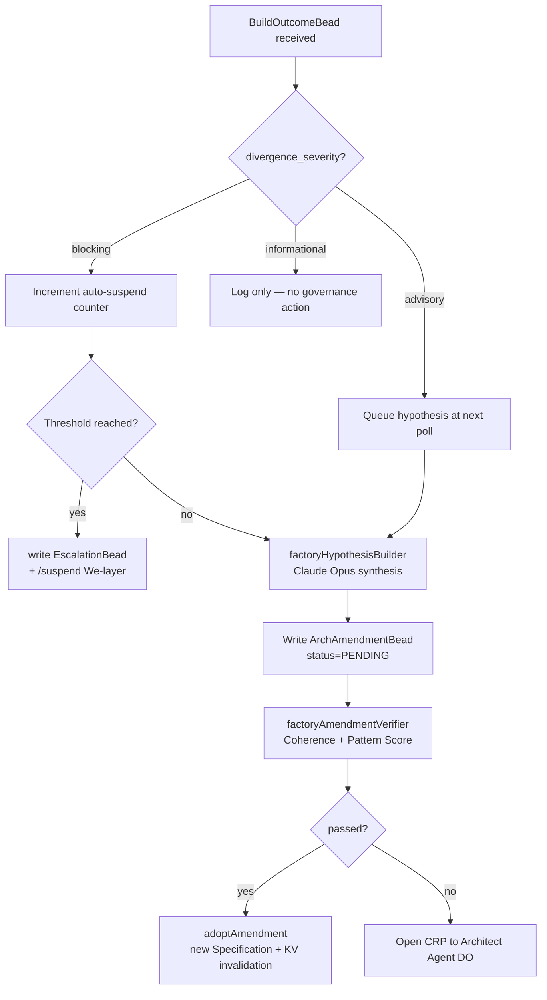
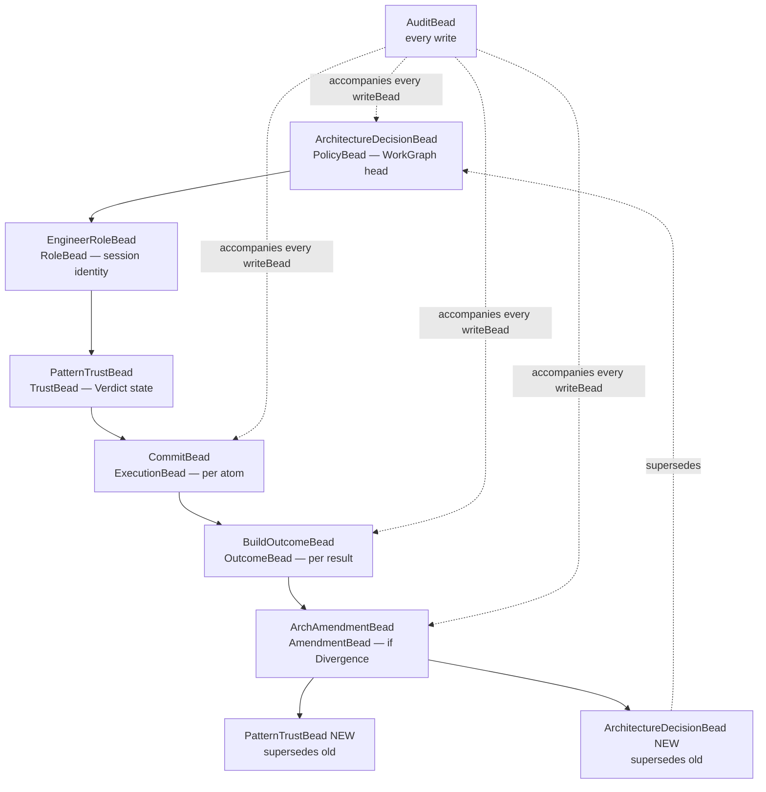

# Flowchart: ksp-factory-graph — Knowing-State Prosthesis Full Loop
> Source: SPEC-KSP-FACTORY-001.md §7 | Module: packages/factory-graph

## Main Call Flow — Seven-Step Loop (Sequence Diagram)



## Divergence Severity Routing



## Package Dependency Graph

```mermaid
graph LR
    FG[packages/factory-graph] --> AG[@factory/artifact-graph]
    FG --> BG_PKG[@factory/bead-graph]
    FG --> LC[@factory/loop-closure]
    LC --> AG
    LC --> BG_PKG
    KSS[@factory/ksp-sdk] --> BG_PKG
    MA_PKG[packages/mediation-agent] --> FG
    MA_PKG --> KSS
    COMM[workers/commissioning] --> FG
    ARCH[packages/architect-agent] --> FG
```

## Bead Graph Topology (repo scope)


