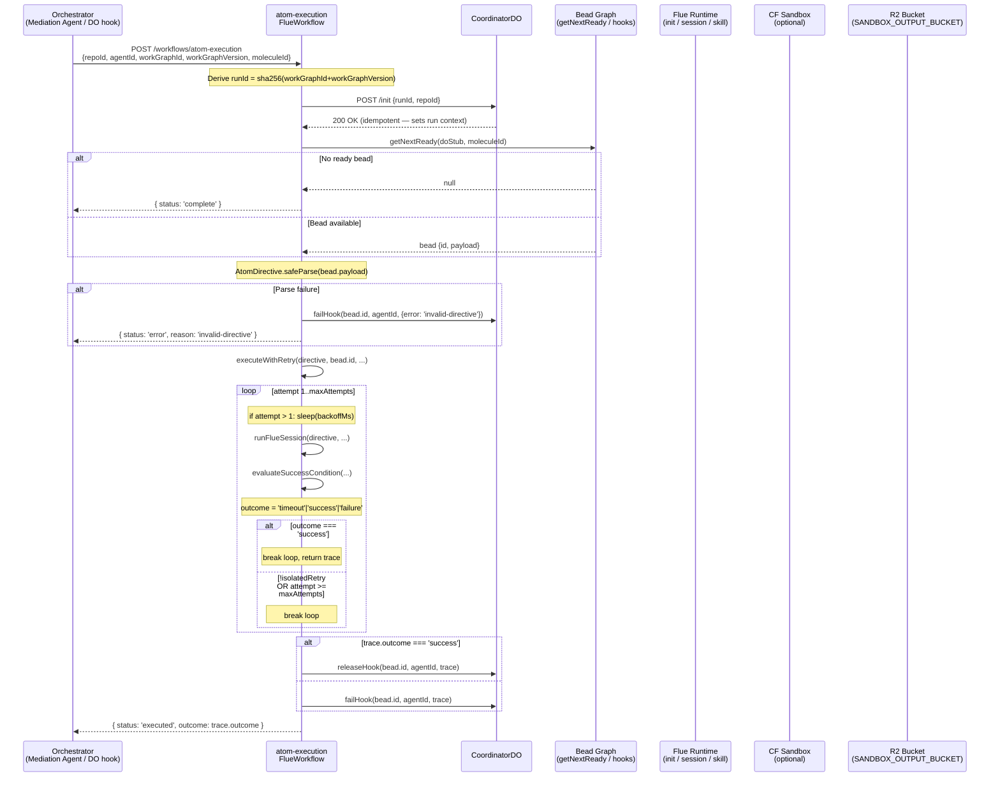
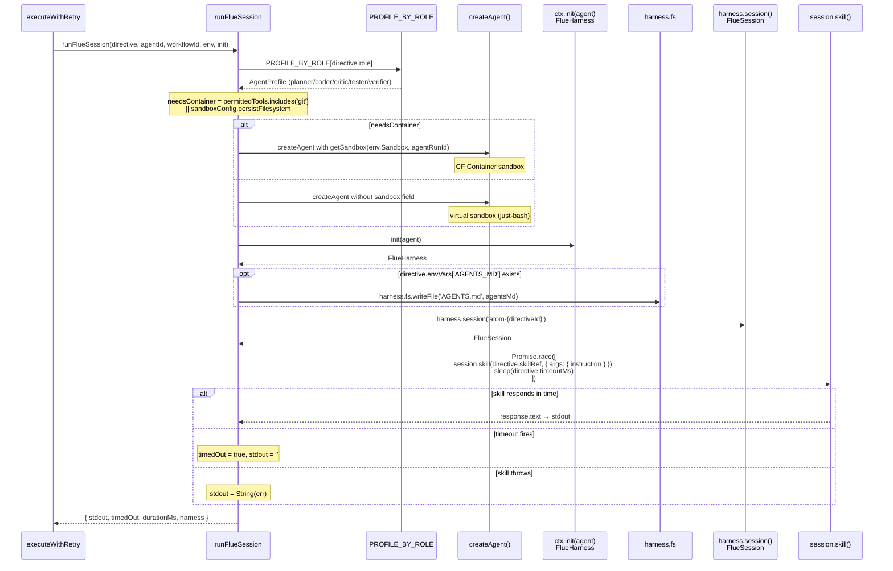
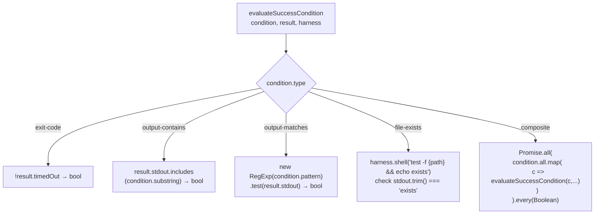
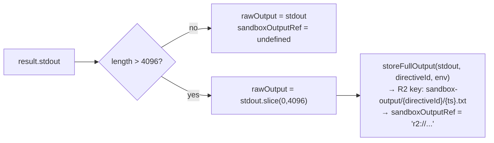
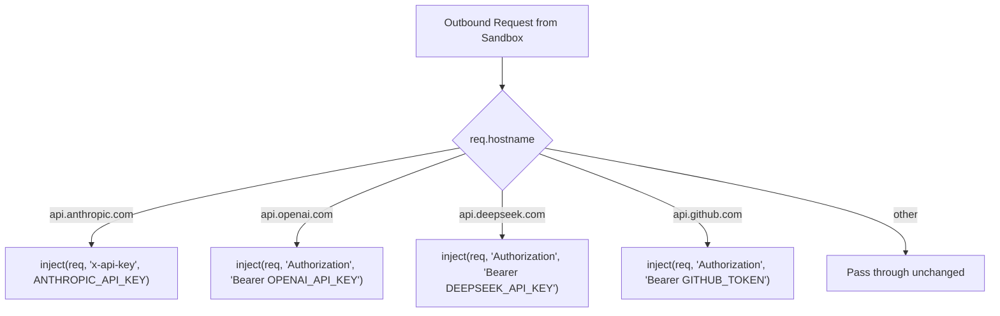

# Flowchart: ksp-flue-workflow (.flue/workflows/atom-execution.ts)

> Source: SPEC-FF-JUSTBASH-001-004.md

---

## Main workflow: `run()` — top-level call flow

---

## `runFlueSession()` — Flue harness bridge points

---

## `evaluateSuccessCondition()` — async dispatch

---

## stdout overflow path

---

## Sandbox outbound injection (`@factory/gears/flue/sandbox.ts`)

