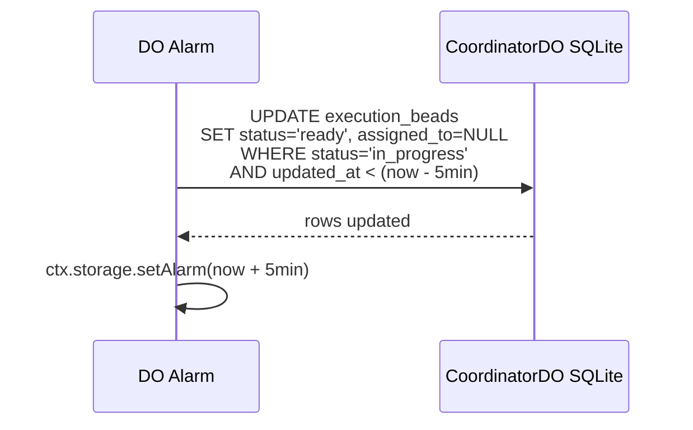
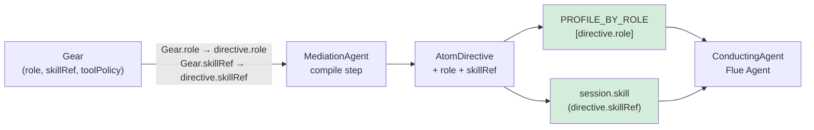

# @factory/gears — Main Call Flow

> Source: SPEC-FF-GEARS-001.md + SPEC-KSP-LOOP-CLOSURE-001.md
> Covers: atom execution harness, CoordinatorDO bead lifecycle, Bridge Point 3 (loop closure)

```mermaid
sequenceDiagram
    autonumber
    participant MA  as MediationAgent DO
    participant AE  as atom-execution.ts<br/>(Flue Workflow)
    participant CDO as CoordinatorDO<br/>(DO SQLite)
    participant SA  as Sandbox<br/>(Cloudflare Container)
    participant CA  as ConductingAgent<br/>(Flue Agent)
    participant LCS as LoopClosureService<br/>(@koales/loop-closure)
    participant AG  as FactoryArtifactGraphDO
    participant BG  as FactoryBeadGraphDO
    participant D1  as D1_AUDIT<br/>(bead_audit table)

    Note over MA,AE: Mediation Agent compiles WorkGraph → dispatches AtomDirective<br/>(skillRef + role set from Gear; runId = SHA-256(workGraphId+workGraphVersion))

    MA->>AE: POST /workflows/atom-execution<br/>{directive: AtomDirective, runId, orgId}

    AE->>CDO: POST /init {runId, orgId}
    CDO-->>CDO: persist runId/orgId to DO storage
    CDO-->>AE: ok

    loop For each ready bead in molecule
        AE->>CDO: POST /next {moleculeId}
        Note over CDO: SELECT ready bead WHERE<br/>all parents status='done'<br/>(FIFO, DAG-ordered)
        CDO-->>AE: ExecutionBead | null

        AE->>CDO: POST /claim {beadId, agentId}
        Note over CDO: CAS UPDATE status='ready'→'in_progress'<br/>attempt_count++<br/>RETURNING *
        CDO-->>AE: ExecutionBead (claimed) | null (lost race)

        AE->>SA: createAgent(PROFILE_BY_ROLE[directive.role])
        Note over SA: Per-role outboundByHost injectors active<br/>toolPolicy gates applied at application layer

        AE->>CA: session.skill(directive.skillRef)<br/>+ execute AtomDirective

        alt Execution SUCCESS
            CA-->>AE: ConductingAgentTraceFragment

            AE->>CDO: POST /release {beadId, agentId, resultJson}
            CDO-->>CDO: UPDATE status='done', result=resultJson
            CDO->>D1: INSERT bead_audit<br/>(run_id, bead_id, gear_id, agent_id,<br/>verdict='done', attempt, ts)
            CDO->>LCS: recordOutcome(beadId, beadId,<br/>{status:'SUCCESS', summary, toolCallCount})

        else Execution FAILURE
            CA-->>AE: error / ConductingAgentTraceFragment

            AE->>CDO: POST /fail {beadId, agentId, resultJson}
            CDO-->>CDO: UPDATE status='failed', result=resultJson
            CDO->>D1: INSERT bead_audit (verdict='failed')
            CDO->>LCS: recordOutcome(beadId, beadId,<br/>{status:'FAILURE', summary, toolCallCount})
        end

        Note over LCS: Bridge Point 3 — SPEC-KSP-LOOP-CLOSURE-001 §2

        LCS->>AG: upsertNode ExecutionTrace<br/>(session_id, outcome, summary, tool_calls)
        LCS->>AG: upsertEdge Execution→ExecutionTrace 'produces'
        LCS->>LCS: detectDivergences(traceId, activeSpecId, artifactGraphDO)

        alt Divergence detected
            LCS->>AG: upsertNode Divergence<br/>(claimId, description, severity)
            LCS->>AG: upsertEdge trace→divergence 'evidences'
            LCS->>AG: upsertEdge trace→spec 'diverges_from'
            LCS->>BG: writeBead OutcomeBead<br/>(artifact_graph_divergence_id = divergenceId)
        else No divergence
            LCS->>BG: writeBead OutcomeBead<br/>(artifact_graph_divergence_id = null)
        end

    end

    Note over CDO: Alarm fires every 5 min<br/>Re-queues in_progress beads<br/>with updated_at < (now - 5min)<br/>→ status='ready', assigned_to=NULL
```

## Stalled Bead Recovery (DO Alarm)



## AtomDirective + Role Routing



> deriveRole() heuristic is DELETED. directive.role is the authoritative selector.
