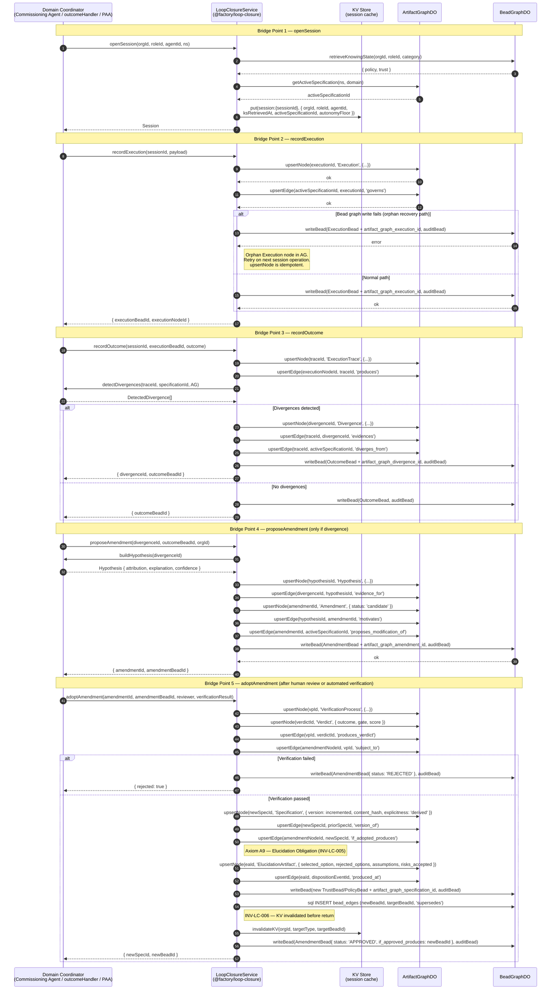
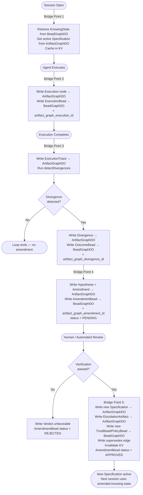

# Flowchart: ksp-loop-closure (@factory/loop-closure)
> Source: SPEC-KSP-LOOP-CLOSURE-001.md

## Main Call Flow — Full Loop Sequence



---

## Simplified Loop Overview



---

## Partial Failure Recovery — Bridge Point 2

```mermaid
sequenceDiagram
    participant LC as LoopClosureService
    participant AG as ArtifactGraphDO
    participant BG as BeadGraphDO

    LC->>AG: upsertNode(executionId, 'Execution', ...)
    AG-->>LC: ok ✓

    LC->>BG: writeBead(ExecutionBead, ...)
    BG-->>LC: error ✗

    Note over LC: Execution node is orphan in AG.<br/>Session continues.

    LC->>LC: Next session operation triggered
    LC->>BG: writeBead(ExecutionBead, ...)  [retry — same executionId]
    BG-->>LC: ok ✓

    Note over LC,AG: upsertNode on AG is idempotent;<br/>no duplicate created on retry.
```
