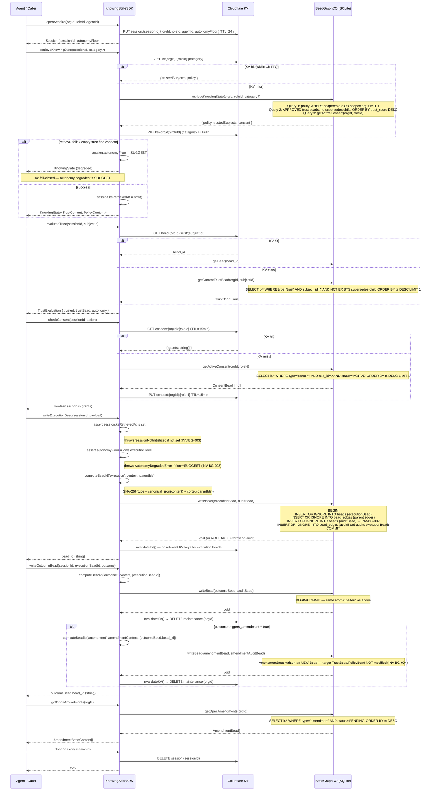
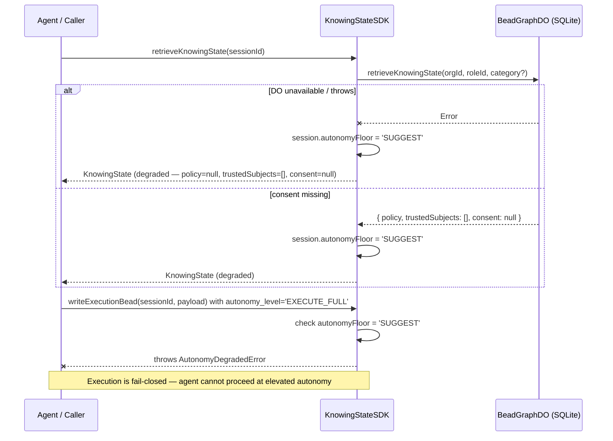
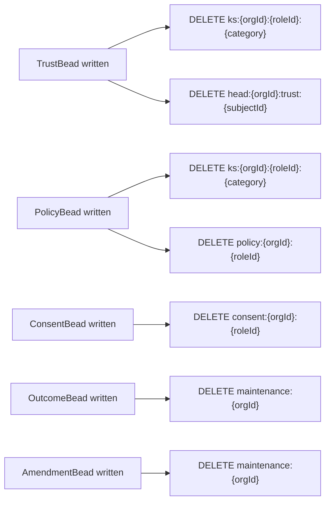

# ksp-sdk — Main Call Flow
> Source: SPEC-KSP-BEAD-GRAPH-001.md §8 (KnowingStateSDK interface)

## Session Lifecycle with Execution Loop



## Fail-Closed Degradation Path (I4)



## Bead Identity Computation

```mermaid
flowchart TD
    A[type: string] --> H
    B[content: Record] --> C[JSON.stringify with sorted keys]
    C --> H
    D[parentIds: string[]] --> E["[...parentIds].sort().join('')"]
    E --> H
    H["SHA-256(type + canonical_json + sorted_parents)"] --> I[bead_id: hex string]
    I --> J{bead_id matches provided id?}
    J -->|yes| K[INSERT OR IGNORE — idempotent]
    J -->|no| L[throw BeadIntegrityError]
```

## KV Invalidation Map


