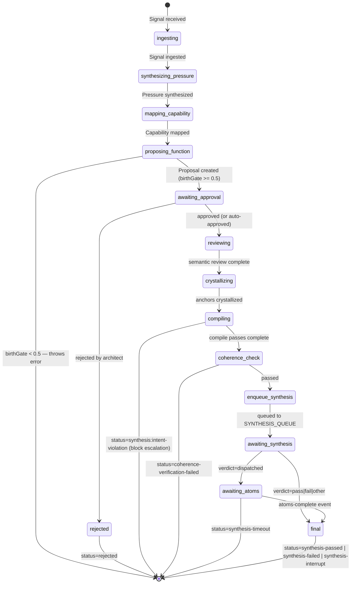
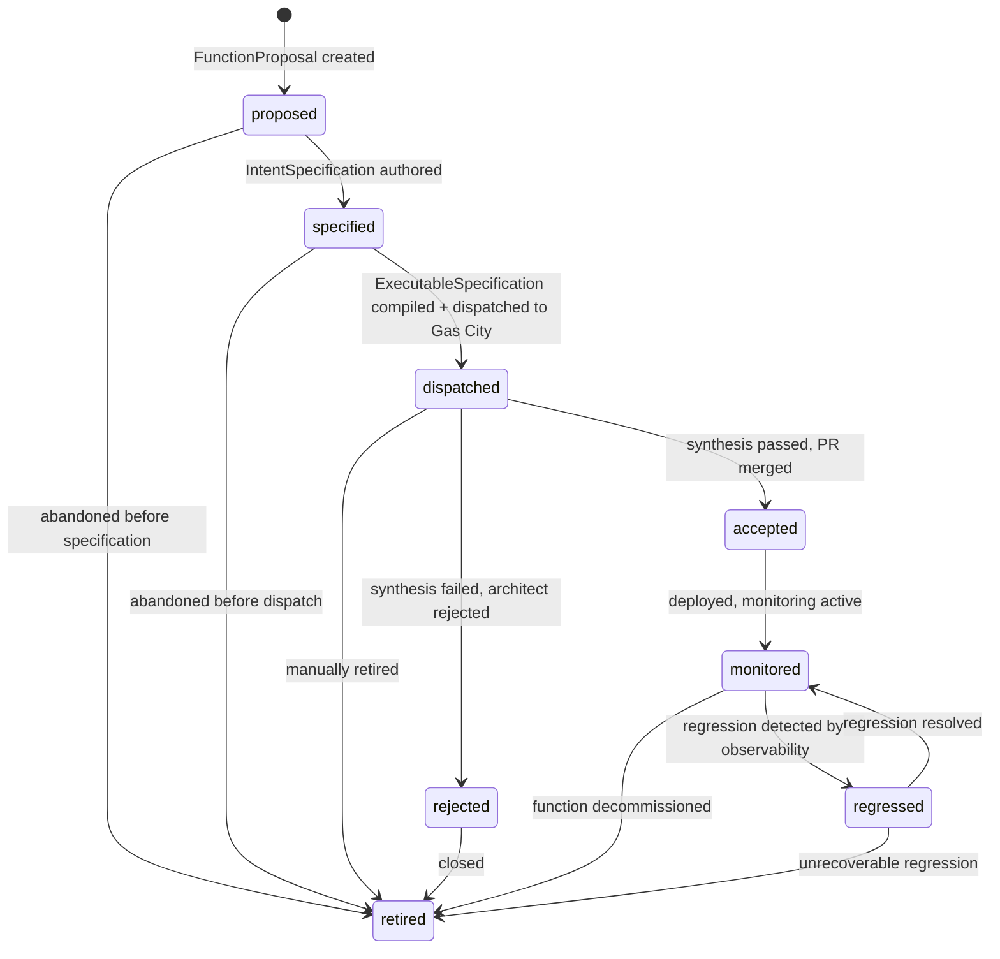
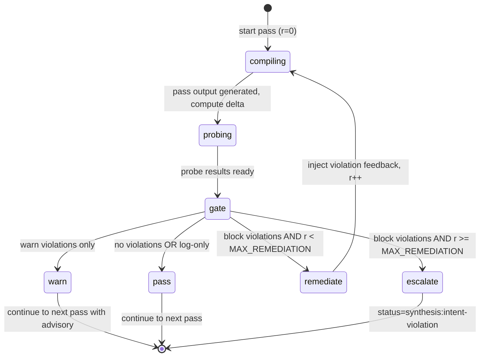
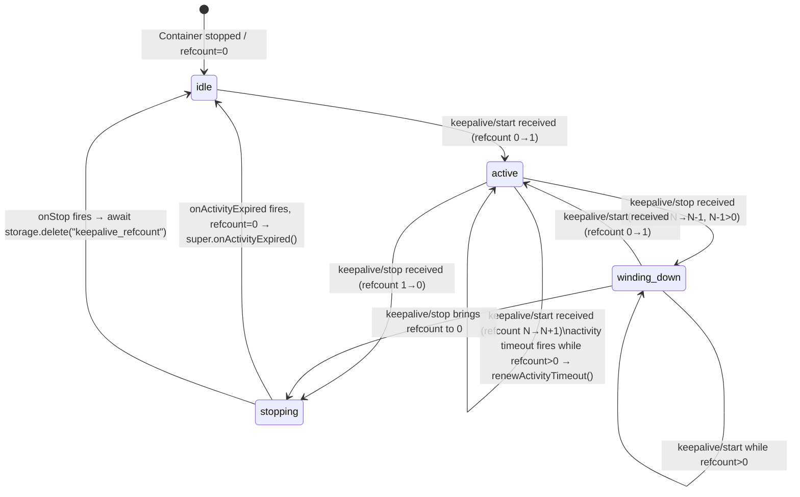
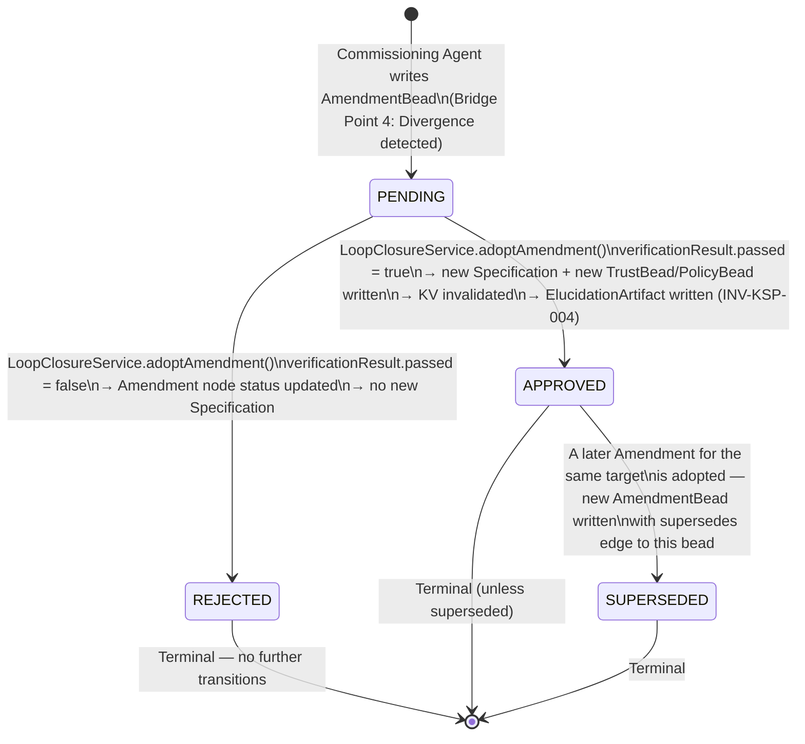
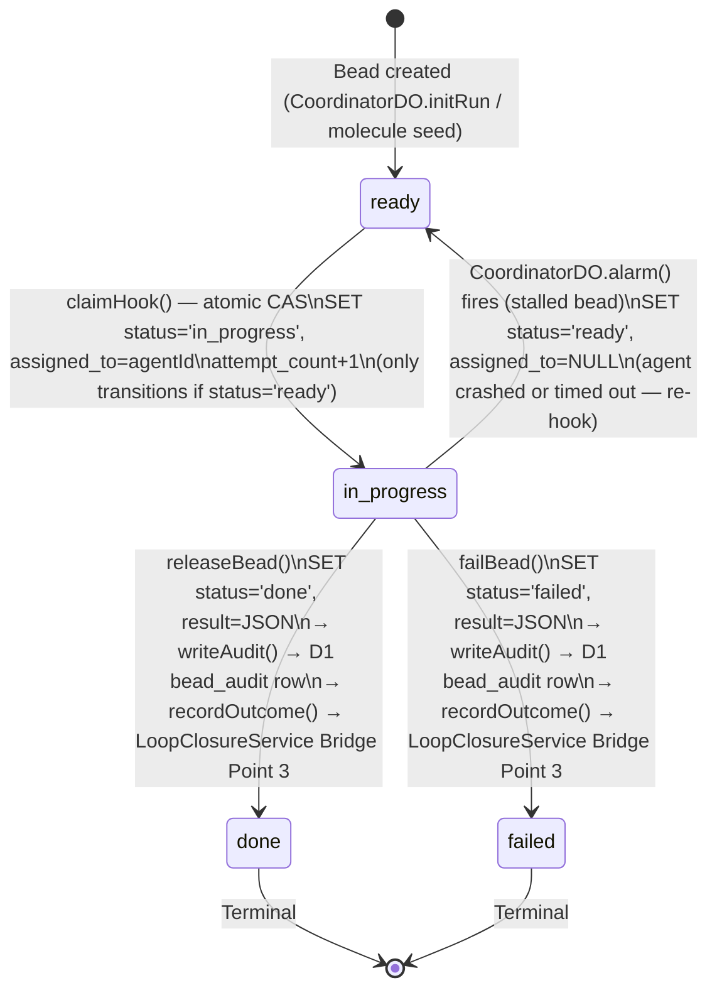
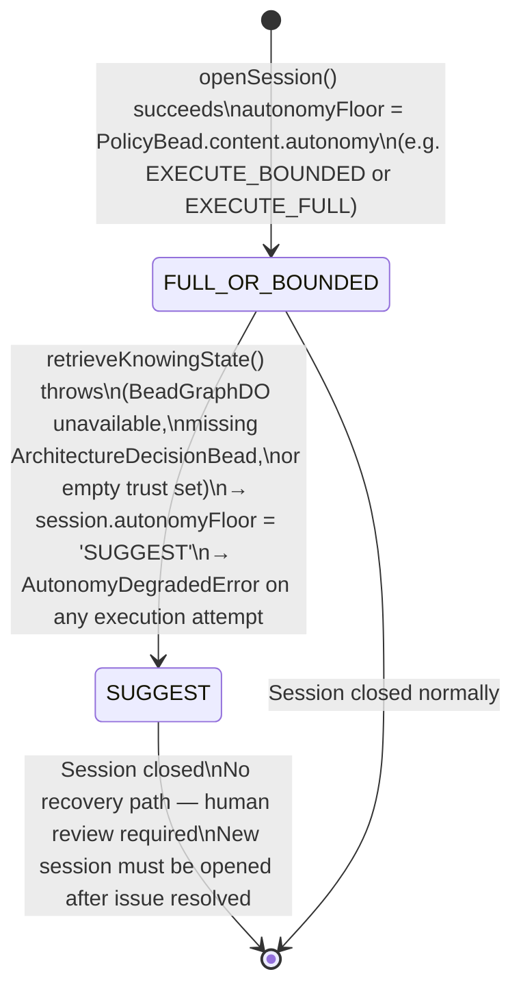
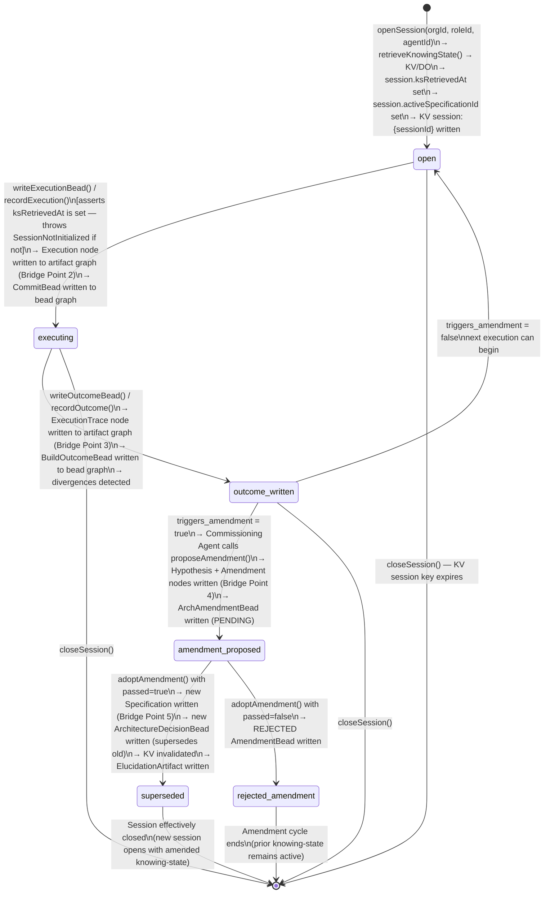

# State Machines — function-factory

> Phase 3 · Detective · Generated 2026-06-08 · Updated 2026-06-10 (KSP forward run)

---

## State Machine 1: Pipeline Run Status

The `FactoryPipeline` Workflow produces a `PipelineResult.status` string on every terminal path.

Origin: `workers/ff-pipeline/src/pipeline.ts` (all terminal return paths)

---

## State Machine 2: Function Lifecycle

Governs how a Function (FunctionProposal) transitions through its operational lifetime.

Transitions enforced by `assertFunctionTransition()` — throws `FunctionLifecycleError` on violation.
Lineage edges written to `lifecycle_transitions` collection for every transition.

Origin: `workers/ff-pipeline/src/gascity/function-lifecycle.ts`

---

## State Machine 3: Intent Anchor Reconciliation Gate

Controls the remediation loop for probed compilation passes.

MAX_REMEDIATION = 2 (maximum 3 total attempts per probed pass).
Only `decompose` is currently in `PROBED_PASSES`.

Origin: `workers/ff-pipeline/src/stages/reconciliation-gate.ts`, `pipeline.ts:compile-verify loop`

---

## State Machine 4: GasCitySupervisor Keepalive Refcount

Controls whether the Gas City Container stays running between formula dispatch and RELEASE callback. The Container Durable Object exposes `keepalive_refcount` in DO storage as the sole state variable; the lifecycle is driven by CF Container platform events.

**States:**
- **idle** — Container sleeping or not started. `keepalive_refcount` = 0 (or key absent).
- **active** — At least one in-flight formula dispatch. `keepalive_refcount` >= 1. `onActivityExpired` renews the activity timeout instead of sleeping.
- **winding_down** — Intermediate state when refcount > 1 and decrements are in progress. Functionally identical to active (renews timeout), shown separately for clarity.
- **stopping** — refcount just reached 0. Next `onActivityExpired` or `onStop` will clean up and allow the container to sleep.

**Transitions triggered by:**
- `POST /v0/keepalive/start` → `formula-compiler.ts` after successful Gas City sling dispatch (best-effort, 5s timeout)
- `POST /v0/keepalive/stop` → `webhook-receiver.ts` on RELEASE or amendment_halted (best-effort, 5s timeout)
- `onActivityExpired` → CF Container platform, fires after `sleepAfter = "30m"` of no traffic
- `onStop` → CF Container platform, fires on Container shutdown

**Failure mode:** A missed keepalive/stop (network failure, pipeline crash) leaves `refcount > 0`. `onActivityExpired` will loop indefinitely (renewing timeout every 30 min) until a manual stop or the platform forcibly kills the DO. No automatic recovery mechanism exists.

Origin: `workers/gascity-supervisor/src/index.ts` (PRs #84 and #85)

---

## KSP State Machines (Forward Run — 2026-06-10)

> Source: SPEC-KSP-ARCH-001, SPEC-KSP-BEAD-GRAPH-001, SPEC-KSP-LOOP-CLOSURE-001, SPEC-KSP-FACTORY-001, SPEC-FF-GEARS-001

---

## State Machine 5: Amendment Lifecycle (Bead Graph)

An `AmendmentBead` begins as `PENDING` when written by the Commissioning Agent (Bridge Point 4). It transitions to `APPROVED` or `REJECTED` based on the result of the `LoopClosureService.adoptAmendment()` call, which runs the domain's `verifyAmendment` function (VerificationProcess → Verdict in artifact graph). Approval causes adoption: a new TrustBead or PolicyBead supersedes the prior one, a new Specification is written to the artifact graph, and KV is invalidated.

**Notes:**
- Amendment status is never updated in place. `APPROVED` and `REJECTED` are new AmendmentBeads with `supersedes` edges to the `PENDING` bead (append-only invariant).
- `SUPERSEDED` is a bead-graph-level state representing a prior approved amendment that has itself been superseded by a subsequent amendment cycle.
- The VerificationProcess and Verdict nodes are written to the artifact graph by `adoptAmendment()` unconditionally — even for `REJECTED` outcomes.

Origin: SPEC-KSP-BEAD-GRAPH-001 §5 (`AmendmentStatus`), SPEC-KSP-LOOP-CLOSURE-001 §2 Bridge Point 5

---

## State Machine 6: ExecutionBead Status (CoordinatorDO)

The `execution_beads` table in `CoordinatorDO` tracks the lifecycle of each bead (work unit) within a WorkGraph execution run. The status field drives the `getNextReady()` dependency-resolution query: a bead is only eligible for dispatch when all parent beads have `status = 'done'`.

**Notes:**
- `claimHook()` uses atomic SQLite CAS: `WHERE id=? AND status='ready'` — only one agent can claim a bead.
- `getNextReady()` queries for `status='ready'` beads whose all parents have `status='done'` (dependency graph respects execution order).
- Stalled bead detection: `CoordinatorDO.alarm()` fires every 5 minutes and re-hooks `in_progress` beads with `updated_at < now - 5min` (crashed agent recovery).
- Both `done` and `failed` trigger `writeAudit()` (D1) and `recordOutcome()` (LoopClosureService Bridge Point 3).

Origin: SPEC-FF-GEARS-001 §7, SPEC-FF-JUSTBASH-003

---

## State Machine 7: Autonomy Floor Degradation

The session `autonomyFloor` governs what level of autonomous action a Conducting Agent session is permitted to take. Under normal operation the floor is set by the `PolicyBead.content.autonomy` value. Under failure conditions (I4 — Fail-closed), the floor degrades to `SUGGEST` unconditionally.

**States:**
- **FULL_OR_BOUNDED** — Normal operating state. `autonomyFloor` is one of `SUGGEST`, `PROPOSE`, `EXECUTE_BOUNDED`, or `EXECUTE_FULL` as specified in the active `ArchitectureDecisionBead`. For the Factory domain, default is `EXECUTE_BOUNDED`.
- **SUGGEST** — Degraded state. Agent may only surface options for human review. `writeExecutionBead()` throws `AutonomyDegradedError`. No autonomous dispatch permitted.

**Trigger for SUGGEST:**
- `BeadGraphDO` stub unavailable (DO evicted or CF edge failure)
- `retrieveKnowingState()` returns null `policy` (no `ArchitectureDecisionBead` written yet)
- Trust set is empty (no approved `PatternTrustBead` for this WorkGraph version)
- `ConsentBead` missing for this role

**Recovery:** The degraded session cannot recover autonomy. A new session must be opened after the root cause is resolved (human writes a new `ArchitectureDecisionBead`, or DO comes back online). There is no in-session upgrade path from `SUGGEST` to a higher floor.

Origin: SPEC-KSP-ARCH-001 §6 I4 enforcement map, SPEC-KSP-BEAD-GRAPH-001 INV-BG-008, SPEC-KSP-FACTORY-001 §7 Step 2

---

## State Machine 8: Session Lifecycle (LoopClosureService)

Tracks the full lifecycle of a session from open through execution, outcome recording, optional amendment proposal, and optional adoption. Sessions are held in KV (`session:{sessionId}` key, 24-hour TTL).

**Notes:**
- The `open` state may recur (multiple executions per session). `outcome_written` loops back to `open` if no amendment is triggered.
- `superseded` is the state where the current session's active specification has been replaced. The next session opened will retrieve the new `ArchitectureDecisionBead` from KV (which was invalidated and refreshed by `adoptAmendment()`).
- The five bridge points in `LoopClosureService` correspond to transitions in this state machine: Bridge Point 1 (open → executing prerequisite), Bridge Points 2–3 (executing → outcome_written), Bridge Point 4 (outcome_written → amendment_proposed), Bridge Point 5 (amendment_proposed → superseded).

Origin: SPEC-KSP-LOOP-CLOSURE-001 §4, SPEC-KSP-BEAD-GRAPH-001 §8 (SDK contract), SPEC-KSP-FACTORY-001 §7
